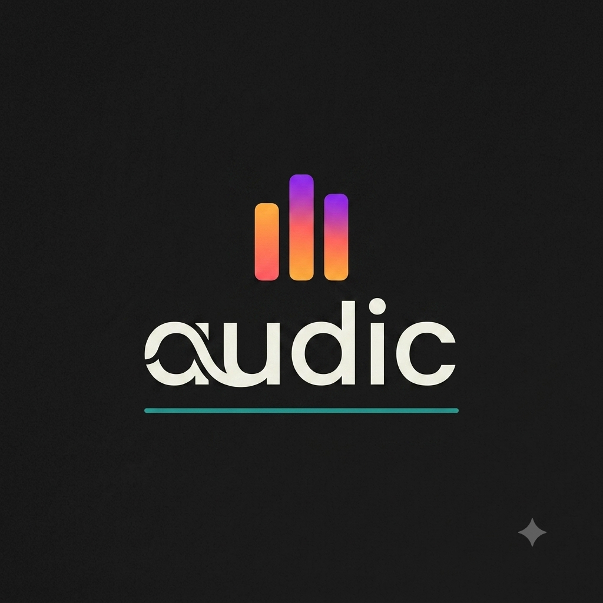
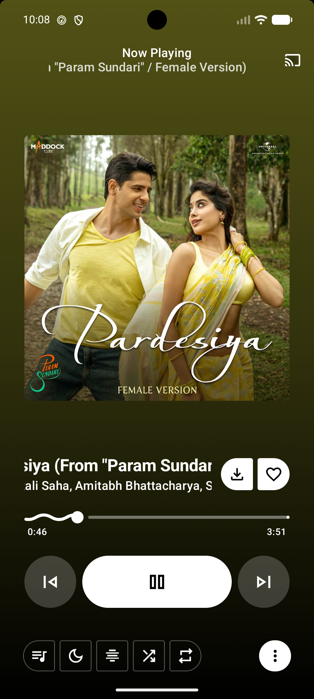

<div align="center">
  

  <h1>Audic Music</h1>

  <p><strong>An ad-free Android music player with real-time synced lyrics, offline downloads, and audio recognition.</strong></p>
</div>

---

## Overview

Audic Music is an ad-free music player with offline downloads, real-time synchronized lyrics, environment-aware music recognition, and on-device AI recommendations.

---

## Table of Contents

- [Overview](#overview)
- [Screenshots](#screenshots)
- [Features](#features)
  - [What's New](#whats-new)
  - [Streaming & Playback](#streaming--playback)
  - [Discovery](#discovery)
  - [Lyrics](#lyrics)
  - [Integrations](#integrations)
  - [Smart Playback](#smart-playback)
  - [Customization](#customization)
- [Installation & Setup](#installation--setup)
  - [Android Installation](#android-installation)
  - [Building from Source](#building-from-source)
- [Special Thanks](#special-thanks)

---

## Screenshots

<div align="center">
  <table style="margin: 0 auto; border-collapse: collapse;">
    <tr>
      <td align="center" style="padding: 10px; border: none;">
        <strong>Home Screen</strong><br><br>
        
      </td>
      <td align="center" style="padding: 10px; border: none;">
        <strong>Music Player</strong><br><br>
        
      </td>
      <td align="center" style="padding: 10px; border: none;">
        <strong>Synchronized Lyrics</strong><br><br>
        
      </td>
    </tr>
    <tr>
      <td align="center" style="padding: 10px; border: none;">
        <strong>Search & Explore</strong><br><br>
        
      </td>
      <td align="center" style="padding: 10px; border: none;">
        <strong>Music Library</strong><br><br>
        
      </td>
      <td align="center" style="padding: 10px; border: none;">
        <strong>Echo Find (Recognition)</strong><br><br>
        
      </td>
    </tr>
  </table>
</div>

---

## Features

### What's New
- **Redesigned UI** — Cleaner, faster, and more intuitive interface from the ground up.
- **Import from Spotify** — Bring your playlists and tracks over with ease.
- **Listen Together** — Sync music in real time, similar to Spotify Jam.
- **Podcast Support** — Listen to podcasts alongside your music library.
- **Local Media Support** — Play music files stored directly on your device.
- **Dynamic Island Support** — Enhanced playback notifications on supported Android devices.

### Streaming & Playback
- **Ad-Free** — Stream without any interruptions.
- **Seamless Playback** — Switch effortlessly between audio-only and video modes.
- **Background Playback** — Listen while using other apps or with the screen off.
- **Offline Mode** — Download tracks, albums, and playlists via a dedicated download manager.
- **Crossfade** — Smooth transitions between tracks.
- **Canvas Animations** — Visual animations while playing music.

### Discovery
- **Echo Find** — Identify songs playing around you using advanced audio recognition.
- **Echo Brain** — On-device AI that analyzes your listening momentum and auto-injects aligned tracks into your queue.
- **Smart Recommendations** — Personalized suggestions based on your listening history.
- **Comprehensive Browsing** — Explore charts, podcasts, moods, and genres.

### Lyrics
- **Multiple Lyric Animations** — Choose from various lyric display styles.
- **Word-by-Word Lyrics** — Precise per-word synchronization.
- **Lyrics+** — Multiple providers for improved accuracy and coverage.
- **AI Translation** — Built-in translation integration for lyrics in any language.

### Integrations
- **Last.fm Scrobbling** — Automatically scrobble plays to your Last.fm account.
- **Music Sharing via Odesli** — Share songs as Song.link for cross-platform listening.
- **Set as Ringtone** — Directly set any song as your device ringtone.

### Smart Playback
- **Pause on Mute** — Auto-pause when your device is muted.
- **Resume on Bluetooth** — Playback resumes when headphones or earbuds reconnect.

### Customization
- **UI Density Scale** — Adjust interface spacing to your preference.
- **High Refresh Rate Support** — Smoother UI and animations on supported displays.
- **Hide Player Thumbnail** — Keep the player minimal without album art.
- **Crop Album Art** — Adjust album art display to fit your style.
- **Hide Video Songs** — Filter out video content from your feed.
- **Hide Shorts** — Keep short-form video content out of your music browsing.

---

## Installation & Setup

### Android Installation

Download the latest pre-compiled APK from the [Releases Page](https://github.com/dindoquitor/audic/releases).

### Building from Source

1. **Clone the Repository**
   ```bash
   git clone https://github.com/dindoquitor/audic.git
   cd audic
   ```

2. **Configure Android SDK**
   Copy the template and set your SDK path:
   ```bash
   cp local.properties.template local.properties
   ```
   Then edit `local.properties` and point `sdk.dir` to your Android SDK:

   | OS | Typical path |
   | :--- | :--- |
   | macOS | `/Users/username/Library/Android/sdk` |
   | Linux | `/home/username/Android/sdk` |
   | Windows | `C:\\Users\\username\\AppData\\Local\\Android\\sdk` |

   If you need a Google API key and Last.fm API credentials, add them to the same file:
   ```properties
   GOOGLE_API_KEY=your_key_here
   LASTFM_API_KEY=your_key_here
   LASTFM_SECRET=your_secret_here
   ```
   *(See [SETUP.md](SETUP.md) for more details.)*

3. **Firebase Configuration (Optional)**
   Firebase is required for analytics and crash reporting. See the instructions in [SETUP.md](SETUP.md#3-configure-firebase-optional) for adding your `google-services.json`.

4. **Build the Application**
   Audic Music has two build variants: **FOSS** (without Google Play Services / Cast) and **GMS** (with Cast support).

   ```bash
   # FOSS Universal Debug
   ./gradlew assembleUniversalFossDebug

   # GMS Universal Debug
   ./gradlew assembleUniversalGmsDebug
   ```
   *(For optimized ARM64 builds, release builds, or other options, refer to [SETUP.md](SETUP.md))*

---

## Special Thanks

Audic Music stands on the shoulders of several excellent open-source projects:

| Project | Description |
| :------ | :---------- |
| [Metrolist](https://github.com/MetrolistGroup/Metrolist) & [Vivi Music](https://github.com/vivizzz007/vivi-music) | Foundational inspiration and architecture reference |
| [ArchiveTune](https://github.com/koiverse/ArchiveTune) | Material You UI inspiration |
| [Better Lyrics](https://better-lyrics.boidu.dev/) | Lyrics enhancement and synchronization |
| [SimpMusic](https://github.com/maxrave-dev/SimpMusic) | Lyrics implementation reference |
| [Music Recognizer](https://github.com/aleksey-saenko/MusicRecognizer) | Audio recognition (Echo Find) |
| [Flow](https://github.com/a-edev/Flow) | AI queue generation engine (Echo Brain) |
| [zemer-cipher](https://github.com/ZemerTeam/zemer-cipher) | Cipher deobfuscation and PoToken generation |
| [Echo Music](https://github.com/EchoMusicApp/Echo-Music) | Inspiration |

---

<div align="center">
  Licensed under <a href="LICENSE">GPL-3.0</a>
</div>
